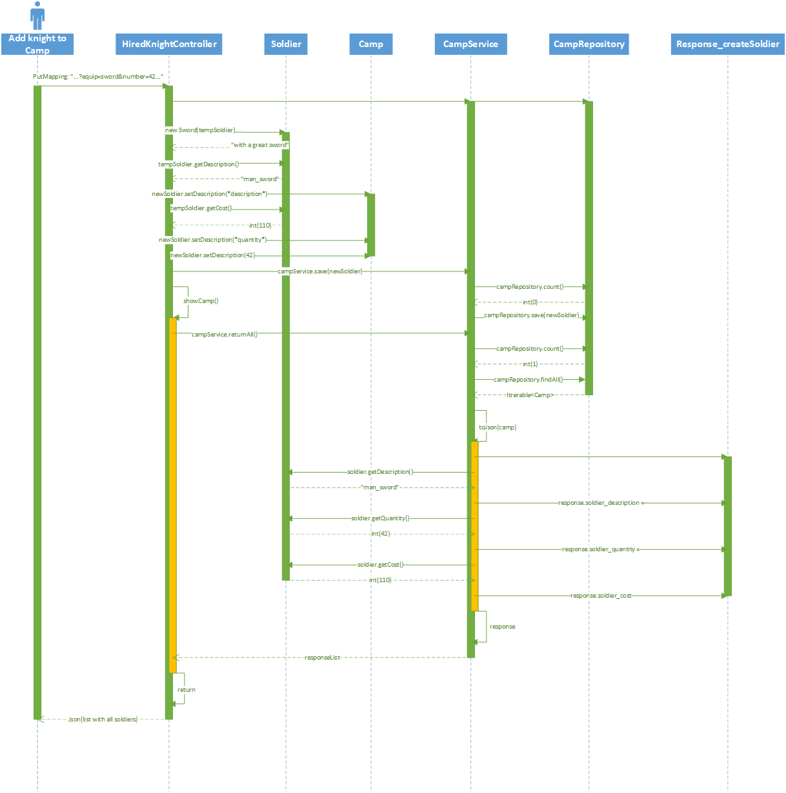

# Class & Sequence Diagram

# Docu Navigation <!-- omit in toc -->
- [README HiredKnight](README.md) 
- [Description](description.md)
- [Testing](testing.md)
- [Usecases](usecases.md)
- [Class & Sequence Diagram](Class&SequenceDiagram.md)
- [Usability Test](usabilitytest.md)
----------------------------------------------------------------------------------
# Class Diagram

We implemented the decorator pattern for the different types of knights that could be designed. This can be seen on the left side and at the bottom of the following diagram.

----------------------------------------------------------------------------------
# Sequence Diagram

This sequence visualizes what happens after the user requests for a soldier to be added to the camp. In this case a soldier with a sword was designed and should now be added to the camp.

