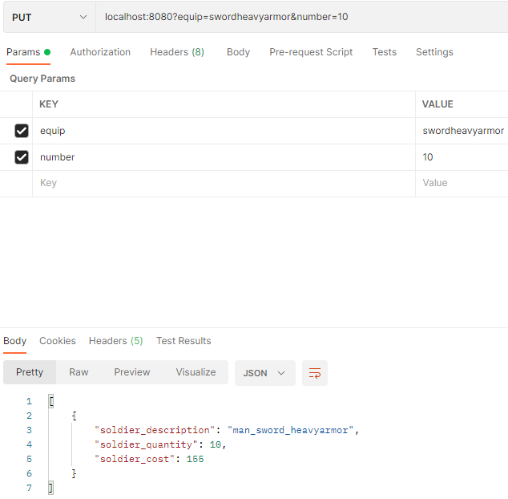
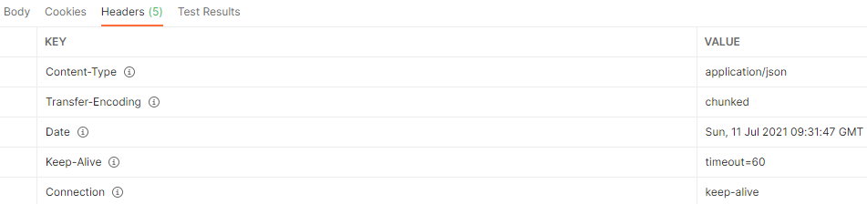
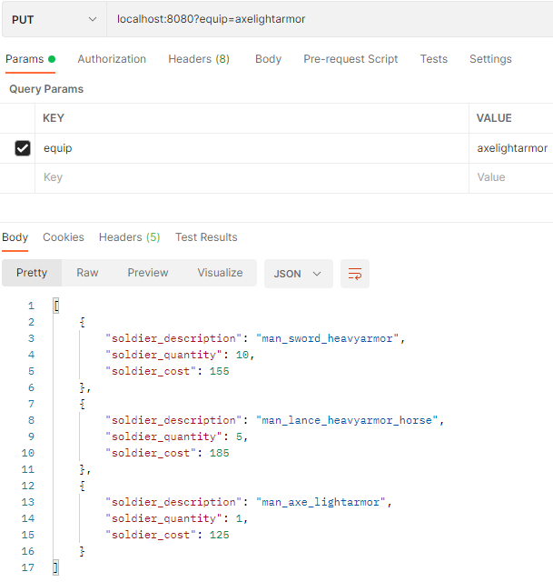

# Testing

# Docu Navigation <!-- omit in toc -->
- [README HiredKnight](README.md) 
- [Description](description.md)
- [Testing](testing.md)
- [Usecases](usecases.md)
- [Class & Sequence Diagram](Class&SequenceDiagram.md)
- [Usability Test](usabilitytest.md)
----------------------------------------------------------------------------------
# Program Test

The following images show how we tested our program. We used the software called "postman" to do so.\
Postman allows for easy testing via custom requests and frequently used tests can be saved for later.

## 1 put(1)
The user designed well armored swordsmen and orders ten units at once.\
As intended the Json file shows that the program correctly identified the heavy swordsmen and understood\
that 10 should be ordered.\
Additionally, the price per unit is calculated. Soldier (80) + sword (30) + heavy armor (45) = 155 gold.

The corresponding header to the request:

## 2 put(2)
This test is very similar to the first one.\
The response now shows both the heavy swordsmen and the newly designed horsemen.

## 3 put(3)
In this test we wanted to check if the default value of 1 is correctly interpreted if the user does not ask for a specific number of units.
The Json indeed shows that one unit of the new lightly armored axe men was added to the camp.

## 4 get
The GET request should return a Json list with all soldiers currently added to the camp. (Soldiers from tests one, two and three)

## 5 delete(1)
With ...
